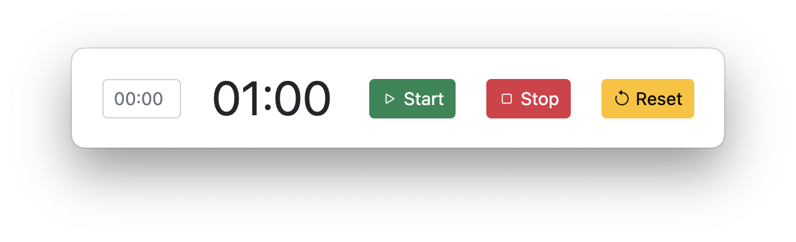

# WT-Timer
Count-Up Timer in React with ability to add minutes and seconds to start time.




## Build it yourself
```
git clone https://github.com/toggenation/wt-timer.git
```

## Develop
```sh
npm run  electron:start
```

## Build

Built files are placed in the `dist/` folder

```sh
# mac
npm run  electron:package:mac

# macOS
npm run electron:package:mac

# Linux
npm run electron:package:linux
```
